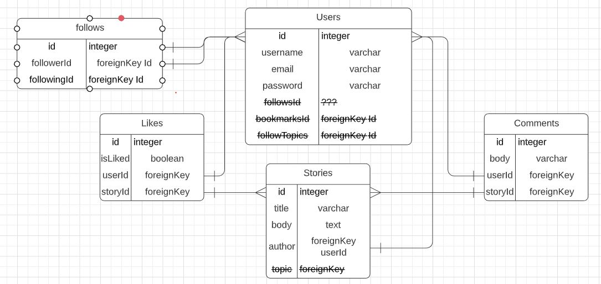

# Schema

## List of Tables:
* Users
* Stories
* Follows
* Comments
* Likes

| Users     | Data Type                   |
|-----------|-----------------------------|
| id        | serial integer pk           |
| username  | varchar(255)                |
| email     | varchar(255)                |
| password  | integer binary              |
| updatedAt | datetype default new Date() |
| createdAt | datetype default new Date() |
 
 
 
 

| Stories   | Data Type                     |
|-----------|-------------------------------|
| id        | serial integer pk             |
| title     | varchar(255)                  |
| body      | text                          |
| userId    | **references Users(id) fk**   |
| storyId   | **references Stories(id) fk** |
| updatedAt | datetype default new Date()   |
| createdAt | datetype default new Date()   |

 
 
 

| Follows    | Data Type                   |
|------------|-----------------------------|
| id         | serial integer pk           |
| followerId | **references Users(id) fk** |
| followedId | **references Users(id) fk** |
| updatedAt  | datetype default new Date() |
| createdAt  | datetype default new Date() |

 
 
 

| Comments  | Data Type                     |
|-----------|-------------------------------|
| id        | serial integer pk             |
| body      | text                          |
| userId    | **references Users(id) fk**   |
| storyId   | **references Stories(id) fk** |
| updatedAt | datetype default new Date()   |
| createdAt | datetype default new Date()   |

 
 
 

| Likes     | Data Type                     |
|-----------|-------------------------------|
| id        | serial integer pk             |
| isLiked   | boolean                       |
| userId    | **references Users(id) fk**   |
| storyId   | **references Stories(id) fk** |
| updatedAt | datetype default new Date()   |
| createdAt | datetype default new Date()   |
